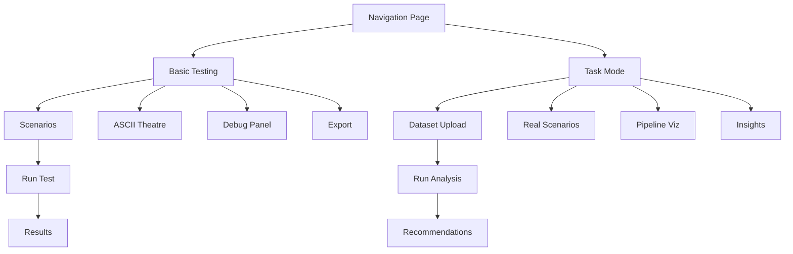

# Agent Chaos Monkey - User Journey Guide 🚀

## 📍 Entry Points

The application has a new unified navigation system accessible at:
- **Main Entry**: http://localhost:8080/docs/index.html
- **Direct Basic Testing**: http://localhost:8080/docs/claude_prototype_enhanced.html
- **Direct Task Mode**: http://localhost:8080/docs/task_mode_standalone.html

## 🎯 Quick Start Path

### First-Time User Journey
```
1. Land on Navigation Page (index.html)
   ↓
2. Click "Start Tour" Button
   ↓
3. Complete 10-Step Guided Tour
   ↓
4. Choose Testing Mode
   ↓
5. Begin Chaos Testing
```

## 🗺️ Complete User Journey Map

### 1️⃣ **Discovery Phase**
User lands on the navigation page and sees:
- **Navigation Header**: Clear mode options (Basic Testing | Task Mode)
- **Tour Button**: Prominent "Start Tour" call-to-action
- **Visual Feedback**: Terminal-themed green interface with glowing effects

### 2️⃣ **Onboarding Journey** (Guided Tour)
The 10-step tour guides users through:

1. **Welcome** - Introduction to chaos engineering concepts
2. **Navigation** - Understanding the interface structure
3. **Basic Testing** - Overview of interactive scenarios
4. **Basic Features** - ASCII theatre, debug mode, controls
5. **Task Mode** - Introduction to advanced testing
6. **Task Features** - Pipeline visualization, actionable insights
7. **Testing Interface** - Understanding the iframe-based system
8. **Progress Tracking** - Tour navigation and progress
9. **Ready State** - Confirmation of understanding
10. **Completion** - Next steps and encouragement

### 3️⃣ **Testing Paths**

#### **Basic Testing Path** (Beginners)
```
Basic Testing → Select Scenario → Configure Parameters → Start Test
     ↓              ↓                    ↓                  ↓
Visual Theatre ← Monitor Effects ← Watch Animation ← See Results
     ↓
Debug Panel → Export Results → Learn & Iterate
```

**Key Actions**:
- Select from pre-configured scenarios (API Meltdown, Latency Spike, etc.)
- Watch real-time ASCII visualization
- Toggle debug mode for detailed logs
- Export results in multiple formats

#### **Task Mode Path** (Advanced Users)
```
Task Mode → Upload Dataset → Select Real-World Scenario → Configure Adapter
    ↓            ↓                    ↓                        ↓
Run Baseline ← Set Prompt ← Choose LLM (Mock/OpenAI/HTTP) ← Preview Effects
    ↓
Run with Chaos → Compare Results → Review Insights → Apply Recommendations
    ↓                  ↓                 ↓                    ↓
Export Report ← Track UX Score ← See Pipeline ← Implement Fixes
```

**Key Actions**:
- Upload test data (JSONL/CSV/Markdown)
- Select real-world scenarios (OpenAI Outage, Rate Limiting, etc.)
- Configure LLM adapter (Local Mock, OpenAI API, HTTP Agent)
- Compare baseline vs chaos performance
- Get actionable code recommendations

## 📊 Feature Discovery Map



## 🎮 User Interaction Patterns

### Navigation Patterns
- **Tab Navigation**: Use Tab key to move between elements
- **Mode Switching**: Click navigation links or use arrow keys
- **Tour Control**: Next/Previous/Close buttons or keyboard shortcuts

### Testing Patterns
- **Scenario Selection**: Click cards or use number keys (1-6)
- **Parameter Adjustment**: Sliders for chaos intensity
- **Test Execution**: Start/Stop/Pause controls
- **Result Analysis**: Interactive charts and exportable reports

## 💡 User Personas & Recommended Paths

### 🎓 **Learning Developer**
**Goal**: Understand chaos engineering principles
**Recommended Path**:
1. Complete full tour
2. Start with Basic Testing
3. Try simple scenarios (500 errors, timeouts)
4. Gradually increase complexity
5. Move to Task Mode when comfortable

### 🏗️ **DevOps Engineer**
**Goal**: Test production resilience
**Recommended Path**:
1. Skip to Task Mode
2. Upload production-like datasets
3. Test real-world scenarios
4. Export actionable reports
5. Implement recommended fixes

### 🔬 **AI/ML Engineer**
**Goal**: Test LLM application resilience
**Recommended Path**:
1. Quick tour overview
2. Direct to Task Mode
3. Configure HTTP agent with actual LLM endpoint
4. Test with chaos scenarios
5. Analyze UX score degradation

## 🔄 Workflow Examples

### Example 1: Testing API Resilience
```
1. Navigate to Basic Testing
2. Select "API Meltdown" scenario
3. Set parameters (500 rate: 50%, 429 rate: 30%)
4. Start test and watch theatre
5. Enable debug mode to see details
6. Export results as JSON
```

### Example 2: LLM Application Testing
```
1. Navigate to Task Mode
2. Upload Q&A dataset (JSONL)
3. Select "OpenAI Outage" scenario
4. Configure HTTP agent (http://localhost:9009)
5. Run baseline test
6. Run with chaos
7. Compare results (UX score drop)
8. Review insights for circuit breaker implementation
```

## 📱 Mobile User Journey

### Touch Interactions
- **Swipe**: Navigate between modes
- **Tap**: Select scenarios and buttons
- **Pinch**: Zoom theatre visualization
- **Long Press**: Access context menus

### Responsive Adaptations
- Collapsed navigation menu
- Stacked layout for controls
- Full-screen theatre mode
- Simplified parameter controls

## 🔍 Troubleshooting Paths

### Common Issues & Solutions

**Tour Not Starting**:
- Check if Driver.js loaded
- Try refreshing page
- Clear localStorage and retry

**Page Not Loading in iframe**:
- Check server is running (port 8080)
- Verify file paths are correct
- Check browser console for errors

**Mock Agent Connection Failed**:
- Ensure mock agent is running (port 9009)
- Check URL is correct (http://localhost:9009)
- Verify CORS settings

## 📈 Success Metrics

### User Engagement Indicators
- ✅ Tour completion rate
- ✅ Mode switching frequency
- ✅ Test execution count
- ✅ Export usage
- ✅ Return visits

### Learning Milestones
1. **Novice**: Completes tour and runs first test
2. **Intermediate**: Uses debug mode and exports results
3. **Advanced**: Switches to Task Mode and uploads data
4. **Expert**: Implements recommendations from insights

## 🚀 Next Steps After Journey

### For Basic Testing Users
- Explore all 6 pre-configured scenarios
- Experiment with parameter combinations
- Learn to interpret debug logs
- Export and analyze results

### For Task Mode Users
- Test with production datasets
- Implement recommended fixes
- Measure resilience improvements
- Create custom chaos scenarios

## 📚 Additional Resources

- **API Documentation**: `/docs/API_REFERENCE.md`
- **Node.js Setup**: `/docs/NODEJS_SETUP.md`
- **Extension Guide**: `/docs/EXTENSION_GUIDE.md`
- **FAQ**: `/docs/faq.md`

---

## 🎯 Key Takeaways

1. **Start with the Tour**: It provides the best introduction
2. **Basic First, Task Later**: Progressive complexity helps learning
3. **Use Debug Mode**: Essential for understanding chaos effects
4. **Export Everything**: Data helps track improvement over time
5. **Apply Insights**: Task Mode recommendations are actionable

Remember: The goal is not just to break things, but to build resilient systems that gracefully handle failures! 🛡️